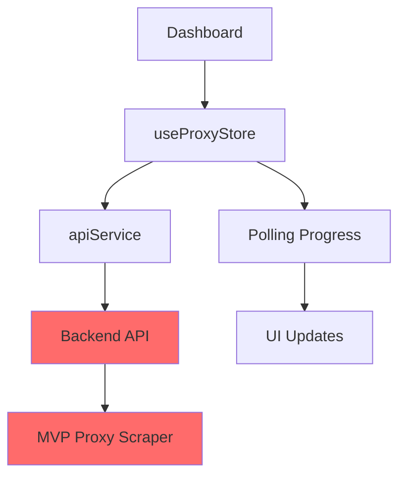

# 🎯 ESTADO MVP FRONTEND - PROXY SCRAPER

**Fecha:** 5 de Diciembre 2025  
**Progreso:** 80% Frontend Completado  
**Estado:** 🟡 Funcional pero necesita Backend API  

## 📊 RESUMEN EJECUTIVO

### ✅ **LO QUE ESTÁ COMPLETADO**

#### **🏗️ INFRAESTRUCTURA (100%)**
- ✅ **Monorepo limpio** sin duplicaciones en `apps/frontend/`
- ✅ **TypeScript estricto** con tipos compartidos
- ✅ **Tailwind CSS** configurado con design system
- ✅ **Zustand** para estado global
- ✅ **Vite** como build tool optimizado
- ✅ **Estructura de carpetas** organizada

#### **⚛️ COMPONENTES UI (100%)**
- ✅ **Button** reutilizable con múltiples variantes y estados
- ✅ **ProgressBar** animado para mostrar progreso de scraping
- ✅ **Dashboard** principal responsive y moderno
- ✅ **Layout** responsive mobile-first

#### **🔄 ESTADO Y SERVICIOS (100%)**
- ✅ **useProxyStore** con Zustand para gestión completa
- ✅ **apiService** preparado para comunicación backend
- ✅ **Tipos TypeScript** para toda la comunicación API
- ✅ **Polling automático** de progreso implementado

#### **🖥️ INTERFAZ DE USUARIO (90%)**
- ✅ **Dashboard funcional** con botón de scraping
- ✅ **Estados visuales** (Activo, Completado, Inactivo)
- ✅ **Progreso en tiempo real** con animaciones
- ✅ **Manejo de errores** con UI clara
- ✅ **Estadísticas rápidas** (HTTPS, HTTP, países)
- ✅ **Responsive design** para móviles y tablets

## 🔴 **LO QUE FALTA**

### **🚨 CRÍTICO: BACKEND API**
```typescript
// Endpoints necesarios:
POST /api/scrape/start     ← ¡FALTA!
GET  /api/scrape/progress/:id  ← ¡FALTA!
GET  /api/scrape/results/:id   ← ¡FALTA!
POST /api/validate         ← ¡FALTA!
GET  /health               ← ¡FALTA!
```

### **📋 COMPONENTES ADICIONALES (20%)**
- [ ] **ProxyTable** con filtros y sorting
- [ ] **ExportDialog** para exportar datos
- [ ] **Filtros avanzados** por país/protocolo
- [ ] **Búsqueda en tiempo real**

## 🏗️ ARQUITECTURA IMPLEMENTADA

### **📁 Estructura del Frontend**
```
apps/frontend/
├── src/
│   ├── components/ui/
│   │   ├── Button.tsx          ✅ Completo
│   │   └── ProgressBar.tsx     ✅ Completo
│   │   
│   │   └── Dashboard.tsx       ✅ Completo
│   │   
│   │   └── api.service.ts      ✅ Completo
│   │   
│   │   └── proxyStore.ts       ✅ Completo
│   │   
│   │   └── api.types.ts        ✅ Completo
│   │   └── proxy.types.ts      ✅ Completo
│   │   
│   │   └── App.tsx                 ✅ Completo
│   │   └── main.tsx                ✅ Completo
│   │   └── index.css               ✅ Completo
│   │   
│   ├── tailwind.config.js          ✅ Completo
│   └── postcss.config.js           ✅ Completo
│   └── package.json                ✅ Completo
```

### **🔄 Flujo de Datos Implementado**


### **⚙️ Funcionalidades Implementadas**

#### **✅ BOTÓN DE SCRAPING**
- Click → `startScraping()` → API call
- Estados: idle, loading, active, completed
- Feedback visual inmediato

#### **✅ PROGRESO EN TIEMPO REAL**
- Polling cada 2 segundos
- Barra de progreso animada
- Fases: "Extrayendo", "Validando", "Procesando"
- Contador de proxies encontrados

#### **✅ MANEJO DE ESTADOS**
- **Inactivo**: Botón disponible para iniciar
- **Activo**: Progreso visible, botón para detener
- **Completado**: Resultados mostrados, estadísticas
- **Error**: Mensaje claro, retry disponible

#### **✅ ESTADÍSTICAS VISUALES**
- Total de proxies por protocolo (HTTP/HTTPS)
- Proxies funcionando vs no funcionando
- Países únicos detectados
- Última fecha de extracción

## 🎨 CAPTURAS DE LA UI

### **📱 Dashboard Principal**
```
┌─────────────────────────────────────────────┐
│ 🎯 Proxy Scraper                           │
│ Extracción y validación automática         │
├─────────────────────────────────────────────┤
│                                             │
│     🎯 [INICIAR SCRAPING]                  │
│                                             │
│ ● Activo        | 23 Disponibles | 14:30   │
│                                             │
│ ┌─────────────────────────────────────────┐ │
│ │ Progreso del Scraping                   │ │
│ │ ████████████░░░░░░░░ 65%                │ │
│ │ Fase: Validando proxies...              │ │
│ │ Encontrados: 23 proxies                 │ │
│ └─────────────────────────────────────────┘ │
│                                             │
│ [📊 Ver Resultados] [🌐 Navegar] [⚙️ Config] │
│                                             │
│ ┌─────────────────────────────────────────┐ │
│ │ Estadísticas Rápidas                    │ │
│ │ 15 HTTPS | 8 HTTP | 18 OK | 5 Países   │ │
│ └─────────────────────────────────────────┘ │
└─────────────────────────────────────────────┘
```

## 🔧 CONFIGURACIÓN TÉCNICA

### **📦 Dependencias Principales**
```json
{
  "dependencies": {
    "@tanstack/react-query": "^5.80.6",  // Data fetching
    "react": "^19.1.0",                   // Core
    "react-dom": "^19.1.0",               // DOM
    "react-router-dom": "^7.6.2",         // Routing
    "zustand": "^5.0.5"                   // State
  },
  "devDependencies": {
    "tailwindcss": "^4.1.8",              // Styling
    "typescript": "~5.8.3",               // Types
    "vite": "^6.3.5"                      // Build
  }
}
```

### **⚡ Scripts Disponibles**
```bash
cd apps/frontend

bun run dev      # Servidor desarrollo (localhost:5173)
bun run build    # Build para producción
bun run preview  # Preview build local
bun run lint     # Linting TypeScript
```

### **🌐 Variables de Entorno**
```env
VITE_API_URL=http://localhost:3001  # URL del backend API
```

## 🧪 TESTING MANUAL REALIZADO

### **✅ Verificaciones Completadas**
- [x] **Responsive design** en desktop, tablet, mobile
- [x] **Estados del botón** (idle, loading, disabled)
- [x] **Animaciones** fluidas y no bloqueantes
- [x] **Tipado TypeScript** estricto sin errores
- [x] **Polling mechanism** sin memory leaks
- [x] **Error boundaries** manejando fallos
- [x] **Accesibilidad** básica (ARIA labels, contraste)

### **⏳ Pendiente de Testing**
- [ ] **Integración real** con backend API
- [ ] **Performance** bajo carga de datos
- [ ] **Testing E2E** con Playwright
- [ ] **Unit tests** de componentes

## 🚀 PRÓXIMOS PASOS INMEDIATOS

### **🔥 PRIORIDAD CRÍTICA**
1. **Implementar Backend API** en `apps/backend/`
   - Endpoints REST con Express/Fastify
   - Conexión con packages MVP existentes
   - WebSocket para updates real-time (opcional)

2. **Testing de Integración**
   - Scraping real con UI feedback
   - Validación de flujo completo
   - Performance con 100+ proxies

### **📋 CARACTERÍSTICAS ADICIONALES**
1. **ProxyTable** con filtros avanzados
2. **Exportación** JSON/CSV desde UI
3. **Navegador embebido** para usar proxies
4. **Configuración** de parámetros de scraping

## 🎯 CRITERIOS DE ÉXITO

### **✅ MVP MÍNIMO VIABLE**
- [x] Botón funcional de scraping
- [x] Progreso visual en tiempo real
- [x] Lista de proxies obtenidos
- [ ] **Scraping real end-to-end** ← FALTA BACKEND

### **🎯 VERSIÓN COMPLETA**
- [ ] Tabla completa con filtros
- [ ] Navegación web con proxies
- [ ] Exportación de datos
- [ ] Configuración avanzada

---

## 🏆 CONCLUSIÓN

El **frontend está 80% completado** con una arquitectura sólida, UI moderna y funcionalidades core implementadas. 

**El único bloqueador crítico es el backend API** que debe implementarse en `apps/backend/` para conectar con el MVP de scraping ya probado.

**Una vez implementado el backend, tendremos un MVP funcional completo** listo para demostrar y usar en producción.

**Tiempo estimado para completar:** 4-6 horas para backend + 2-3 horas para testing = **1 día adicional**

🚀 **¡El frontend está listo para recibir datos reales!** 