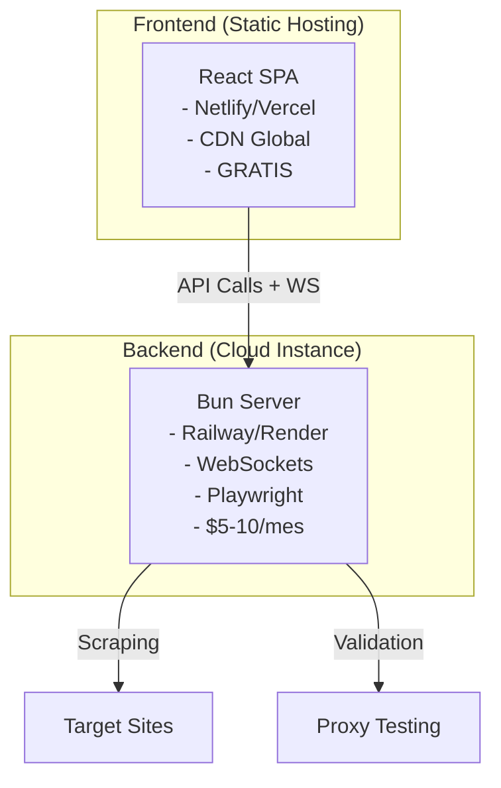
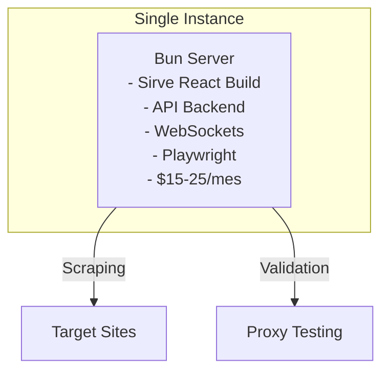
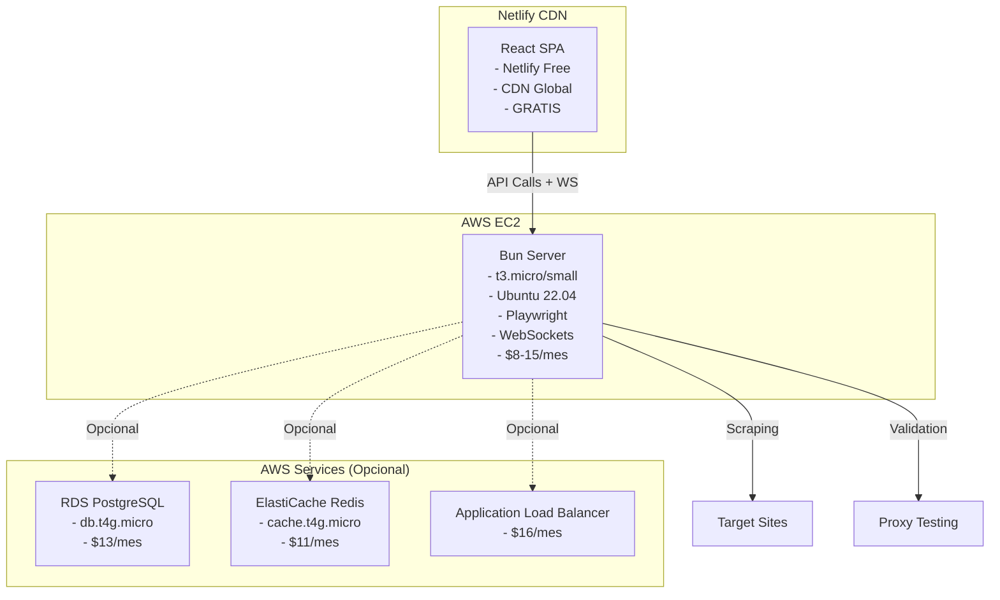
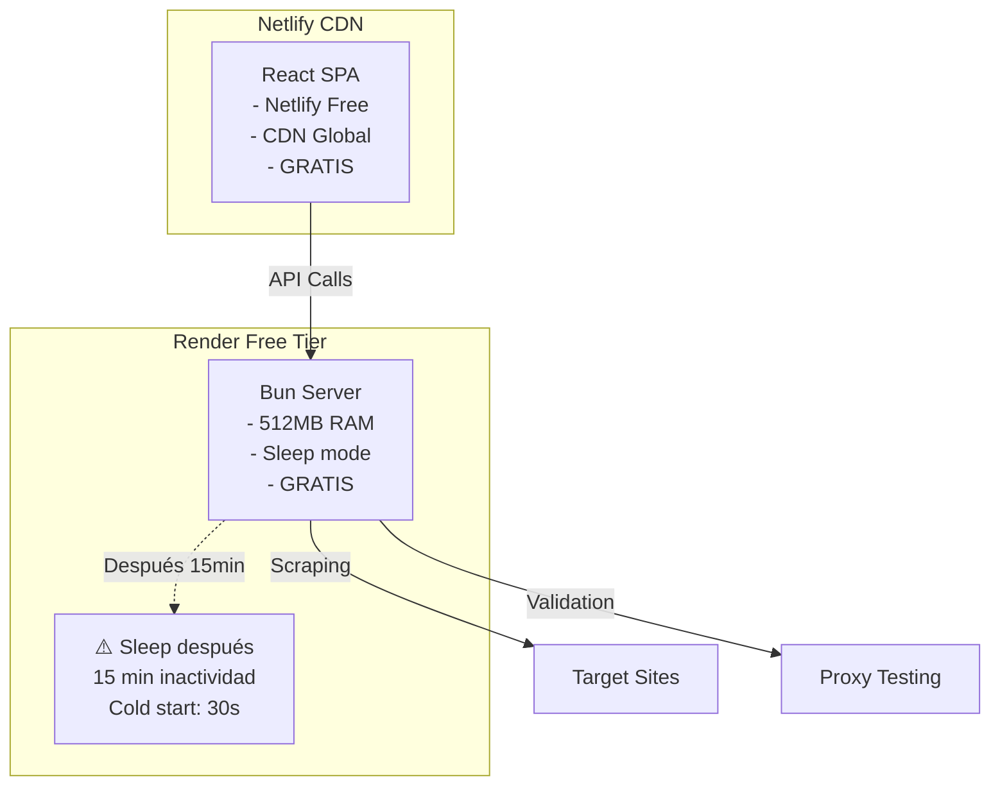

# 🌐 ESTRATEGIA DE HOSTING - Proxy Scraper con Validación

**Fecha:** 5 de Diciembre 2025  
**Proyecto:** Scraper de Proxies con Validación  
**Objetivo:** Análisis completo de opciones de hosting para React SPA + Bun Backend

---

## 📊 RESUMEN EJECUTIVO

### **🎯 RECOMENDACIÓN FINAL**

**Por tipo de uso:**

#### **🥇 SCRAPING PROFESIONAL/PRODUCCIÓN**

**Frontend + Backend Separados (Opción 1)**:

- **🌐 Frontend (React SPA)**: Netlify/Vercel (gratis)
- **⚡ Backend (Bun Server)**: Railway/Render ($5-10/mes)

**Ideal para:** Scraping intensivo, validación completa con Playwright, WebSockets real-time, múltiples páginas.

#### **🥈 CONTROL TOTAL/EMPRESARIAL**

**Netlify + AWS VPS (Opción 4)**:

- **🌐 Frontend (React SPA)**: Netlify (gratis)
- **☁️ Backend (Bun Server)**: AWS EC2 t3.micro ($8-12/mes)

**Ideal para:** Control completo de infraestructura, compliance empresarial, customización total, datos sensibles.

#### **🥉 PROTOTIPO/MVP RÁPIDO**

**Vercel + Next.js Serverless (Opción 3)**:

- **🚀 App Completa**: Vercel Hobby (gratis)

**Ideal para:** Demos, prototipos, scraping ligero, validación básica, desarrollo rápido.

#### **🆓 PROYECTO PERSONAL/APRENDIZAJE**

**Netlify + Render Free (Opción 5)**:

- **🌐 Frontend (React SPA)**: Netlify (gratis)
- **⚡ Backend (Bun Server)**: Render Free (gratis con sleep mode)

**Ideal para:** Proyectos personales, aprendizaje, prototipos, demos educativos, testing ocasional.

#### **💎 SEMI-PROFESIONAL/PORTFOLIO**

**Netlify + Render Hobby (Opción 6)**:

- **🌐 Frontend (React SPA)**: Netlify (gratis)
- **⚡ Backend (Bun Server)**: Render Hobby ($7/mes, always-on)

**Ideal para:** Portfolios profesionales, MVPs para clientes, scraping regular sin interrupciones, custom domains.

#### **🏢 EMPRESARIAL/ALTA DEMANDA**

**Hosting Unificado (Opción 2)**:

- **🏢 Servidor Dedicado**: Railway Pro/DigitalOcean ($12-20/mes)

**Ideal para:** Control total, compliance, traffic intenso, recursos garantizados.

**Ventajas clave:** Cada opción optimizada para diferentes casos de uso y presupuestos.

---

## 🏗️ ARQUITECTURAS ANALIZADAS

### **🔀 OPCIÓN 1: HOSTING SEPARADO (RECOMENDADO)**



#### **✅ VENTAJAS**

- **Performance máximo**: CDN global para frontend, servidor optimizado para backend
- **Escalabilidad independiente**: Frontend escala gratis, backend según demanda
- **Costo-eficiencia**: Frontend gratis, backend solo lo necesario
- **Deployment especializado**: Build optimizado para cada componente
- **Mantenimiento sencillo**: Actualizaciones independientes

#### **❌ DESVENTAJAS**

- **CORS configuration**: Requiere configuración entre dominios
- **Dos deploys**: Frontend y backend por separado (automatizable)

---

### **🔀 OPCIÓN 2: HOSTING UNIFICADO**



#### **✅ VENTAJAS**

- **Simplicidad**: Un solo deploy, un solo dominio
- **Sin CORS**: Mismo origen para frontend y backend
- **Configuración única**: Una sola instancia que manejar

#### **❌ DESVENTAJAS**

- **Costo mayor**: Servidor siempre activo para servir archivos estáticos
- **Escalabilidad limitada**: Frontend y backend acoplados
- **Resources desperdiciados**: CDN gratuito no utilizado
- **Deployment complejo**: Build + bundle en mismo proceso

---

### **🔀 OPCIÓN 3: VERCEL + NEXT.JS SERVERLESS**

```mermaid
graph TB
    subgraph "Vercel Platform"
        A[Next.js App<br/>- React Frontend<br/>- API Routes<br/>- Edge Functions<br/>- GRATIS hasta límites]
    end

    subgraph "Serverless Functions"
        B[/api/scrape<br/>- Playwright<br/>- 10s timeout<br/>- Cold starts]
        C[/api/validate<br/>- Proxy testing<br/>- Concurrent limits]
    end

    A --> B
    A --> C
    B -->|Scraping| D[Target Sites]
    C -->|Validation| E[Proxy Testing]
```

#### **✅ VENTAJAS**

- **Costo ultra-bajo**: Gratis hasta límites generosos
- **Escalabilidad automática**: Serverless scaling sin configuración
- **Deploy instantáneo**: Push to deploy con Git integration
- **Performance global**: Edge network + cache automático
- **Zero config**: Next.js + Vercel integración perfecta

#### **❌ DESVENTAJAS**

- **⚠️ Timeouts estrictos**: 10 segundos máximo por function (Hobby plan)
- **⚠️ Cold starts**: 1-3 segundos de delay inicial
- **⚠️ Memory limits**: 1024MB máximo en Hobby plan
- **⚠️ Concurrency limits**: Máximo 1000 ejecuciones simultáneas
- **⚠️ Playwright constraints**: Bundle size y dependencies pesadas
- **Vendor lock-in**: Muy específico a Vercel/Next.js

#### **🎯 IDEAL PARA:**

- **Scraping liviano**: Páginas simples, pocas requests
- **Validación básica**: Timeouts cortos, sin Playwright completo
- **Prototipos rápidos**: MVP y demos
- **Tráfico esporádico**: No scraping continuo 24/7

#### **❌ NO RECOMENDADO PARA:**

- **Scraping intensivo**: Múltiples páginas, timeouts largos
- **Playwright completo**: Browser automation pesada
- **Validación exhaustiva**: Testing detallado de proxies
- **Real-time updates**: WebSockets persistentes

---

### **🔀 OPCIÓN 4: NETLIFY + AWS VPS**



#### **✅ VENTAJAS**

- **💪 Control total**: Acceso SSH completo, cualquier configuración
- **🔒 Seguridad empresarial**: VPC privada, Security Groups, IAM roles
- **📈 Escalabilidad**: Resize vertical/horizontal según demanda
- **💾 Persistencia**: EBS volumes, snapshots automáticos
- **🌐 Infraestructura global**: Multi-región si necesitas
- **🔧 Flexibilidad**: Cualquier software, versiones, configuraciones
- **📊 Monitoreo avanzado**: CloudWatch, X-Ray, detailed metrics
- **💰 Costo predecible**: Facturación fija mensual

#### **❌ DESVENTAJAS**

- **🛠️ Administración manual**: Updates, patches, security
- **⚙️ DevOps requerido**: Configuración inicial más compleja
- **💸 Costos crecientes**: Services adicionales se suman rápido
- **🚨 Responsabilidad total**: Uptime, backups, monitoring
- **⏰ Setup time**: 2-4 horas configuración inicial vs 15 min PaaS

#### **🎯 IDEAL PARA:**

- **Empresas**: Compliance, auditorías, datos sensibles
- **Alto control**: Configuraciones específicas, software custom
- **Escalabilidad planificada**: Growth previsible y controlado
- **Integración AWS**: Ya usando otros servicios AWS
- **Team DevOps**: Experiencia en administración de servidores

#### **❌ NO RECOMENDADO PARA:**

- **Startups**: Setup complejo para MVP rápidos
- **Proyectos personales**: Overhead de administración
- **Sin experiencia DevOps**: Curva de aprendizaje empinada
- **Presupuesto limitado**: Costos pueden crecer rápidamente

---

### **🔀 OPCIÓN 5: NETLIFY + RENDER FREE**



#### **✅ VENTAJAS**

- **💰 Costo cero**: Completamente gratis para proyectos personales
- **🚀 Setup rápido**: Deploy en minutos, zero config
- **📦 Funcionalidad completa**: Playwright + WebSockets funcionan
- **🔄 CI/CD automático**: Git push to deploy
- **🌐 SSL automático**: HTTPS incluido sin configuración
- **📊 Logs incluidos**: Debugging básico disponible
- **🔧 Sin administración**: Mantenimiento automático
- **📱 Perfecto para demos**: Ideal para portfolios y pruebas

#### **❌ DESVENTAJAS**

- **😴 Sleep mode**: Aplicación duerme tras 15 min inactividad
- **🐌 Cold starts**: 30-60 segundos para despertar
- **⏰ Límite mensual**: 750 horas/mes (suficiente para uso normal)
- **💾 RAM limitada**: 512MB (puede ser insuficiente para Playwright intensivo)
- **🚫 No WebSockets persistentes**: Conexiones se cortan con sleep
- **📈 Sin escalabilidad**: Una sola instancia, no auto-scaling

#### **🎯 IDEAL PARA:**

- **Proyectos personales**: Aprendizaje, experimentación
- **Prototipos educativos**: Demos para clases o tutoriales
- **Testing ocasional**: Scraping esporádico, no continuo
- **Portfolios**: Mostrar habilidades técnicas
- **Desarrollo**: Testing de features antes de producción
- **Presupuesto $0**: Cuando no puedes invertir dinero

#### **❌ NO RECOMENDADO PARA:**

- **Scraping continuo**: Se duerme cada 15 minutos
- **Aplicaciones críticas**: Cold starts impredecibles
- **Alta concurrencia**: RAM insuficiente para muchos usuarios
- **WebSockets 24/7**: Conexiones persistentes se cortan
- **Producción real**: Experiencia de usuario inconsistente

#### **💡 TIPS DE OPTIMIZACIÓN**

```typescript
// Implementar keep-alive para evitar sleep
setInterval(async () => {
  try {
    await fetch(`${process.env.API_URL}/health`);
    console.log("Keep-alive ping sent");
  } catch (error) {
    console.log("Keep-alive failed:", error);
  }
}, 14 * 60 * 1000); // Cada 14 minutos

// Manejo graceful de cold starts
export const withColdStartHandling = (handler: Function) => {
  return async (...args: any[]) => {
    const startTime = Date.now();
    try {
      const result = await handler(...args);
      const duration = Date.now() - startTime;

      if (duration > 10000) {
        console.warn(`Cold start detected: ${duration}ms`);
      }

      return result;
    } catch (error) {
      console.error("Handler error:", error);
      throw error;
    }
  };
};
```

---

## 💰 ANÁLISIS DE COSTOS

### **📊 HOSTING SEPARADO (Opción 1)**

| **Componente**    | **Proveedor** | **Plan**       | **Costo/Mes** | **Incluye**                        |
| ----------------- | ------------- | -------------- | ------------- | ---------------------------------- |
| **Frontend**      | Netlify       | Starter (Free) | $0            | 100GB bandwidth, 300 build minutes |
| **Frontend Alt.** | Vercel        | Hobby (Free)   | $0            | 100GB bandwidth, edge functions    |
| **Backend**       | Railway       | Hobby          | $5            | 512MB RAM, $5 credit/mes           |
| **Backend Alt.**  | Render        | Starter        | $7            | 512MB RAM, custom domain           |
| **Backend Alt.**  | Render        | Hobby          | $7            | 512MB RAM, always-on, sin sleep    |
| **Backend Alt.**  | Fly.io        | Machines       | $3-8          | 256MB-512MB RAM, pay-per-use       |

**🎯 TOTAL ESTIMADO: $5-8/mes**

### **📊 HOSTING UNIFICADO (Opción 2)**

| **Componente**   | **Proveedor** | **Plan** | **Costo/Mes** | **Incluye**               |
| ---------------- | ------------- | -------- | ------------- | ------------------------- |
| **App Completa** | Railway       | Pro      | $15           | 2GB RAM, custom domain    |
| **App Completa** | Render        | Standard | $20           | 1GB RAM, custom domain    |
| **App Completa** | DigitalOcean  | Droplet  | $12           | 1GB RAM, 1 vCPU, 25GB SSD |

**🎯 TOTAL ESTIMADO: $12-20/mes**

### **📊 NETLIFY + AWS VPS (Opción 4)**

| **Componente**       | **Servicio**      | **Plan/Tipo**   | **Costo/Mes** | **Incluye**                        |
| -------------------- | ----------------- | --------------- | ------------- | ---------------------------------- |
| **Frontend**         | Netlify           | Free            | $0            | 100GB bandwidth, 300 build minutes |
| **Backend (Básico)** | AWS EC2 t3.micro  | 1 vCPU, 1GB RAM | $8.50         | 750 horas gratis primer año        |
| **Backend (Prod)**   | AWS EC2 t3.small  | 2 vCPU, 2GB RAM | $17           | Mejor para Playwright              |
| **Storage**          | AWS EBS gp3       | 20GB            | $2            | SSD persistent storage             |
| **Network**          | AWS Data Transfer | Out to Internet | $2-5          | Primeros 100GB gratis/mes          |

**🎯 COSTO BASE: $8-12/mes (t3.micro) / $15-22/mes (t3.small)**

**📈 SERVICIOS ADICIONALES (Opcionales):**

| **Componente**    | **Servicio**          | **Plan/Tipo**   | **Costo/Mes** | **Beneficio**                   |
| ----------------- | --------------------- | --------------- | ------------- | ------------------------------- |
| **Base de Datos** | AWS RDS PostgreSQL    | db.t4g.micro    | $13           | Managed DB, backups automáticos |
| **Cache**         | AWS ElastiCache Redis | cache.t4g.micro | $11           | Session storage, results cache  |
| **Load Balancer** | AWS Application LB    | Standard        | $16           | SSL termination, health checks  |
| **Domain + SSL**  | AWS Route 53 + ACM    | Hosted Zone     | $0.50         | DNS management + SSL gratis     |
| **Monitoring**    | AWS CloudWatch        | Detailed        | $3-8          | Logs, metrics, alarms           |

**🎯 COSTO COMPLETO: $25-45/mes (con todos los servicios)**

**⚠️ CONSIDERACIONES AWS:**

- **Free Tier**: t3.micro gratis primer año (750 horas/mes)
- **Data Transfer**: Primeros 100GB gratis, después $0.09/GB
- **EBS Storage**: gp3 más económico que gp2
- **Reserved Instances**: 30-50% descuento con compromiso 1-3 años

### **📊 VERCEL + NEXT.JS SERVERLESS (Opción 3)**

| **Componente**   | **Proveedor** | **Plan** | **Costo/Mes** | **Límites**                          |
| ---------------- | ------------- | -------- | ------------- | ------------------------------------ |
| **App Completa** | Vercel        | Hobby    | $0            | 100GB bandwidth, 100GB-hours compute |
| **Upgrade**      | Vercel        | Pro      | $20           | 1TB bandwidth, 1000GB-hours compute  |

**🎯 COSTO REAL:**

- **Scraping ligero**: $0/mes (dentro de límites gratuitos)
- **Scraping intensivo**: $20/mes (requiere plan Pro por timeouts)

**⚠️ CONSIDERACIONES TÉCNICAS:**

- **Function timeout**: 10s (Hobby) / 60s (Pro)
- **Bundle size limit**: 50MB compressed
- **Memory**: 1024MB máximo
- **Cold start penalty**: 1-3 segundos primera ejecución

### **📊 NETLIFY + RENDER FREE (Opción 5)**

| **Componente** | **Proveedor** | **Plan** | **Costo/Mes** | **Límites/Incluye**                  |
| -------------- | ------------- | -------- | ------------- | ------------------------------------ |
| **Frontend**   | Netlify       | Free     | $0            | 100GB bandwidth, 300 build minutes   |
| **Backend**    | Render        | Free     | $0            | 512MB RAM, 750 horas/mes, sleep mode |

**🎯 COSTO TOTAL: $0/mes**

**⚠️ LIMITACIONES CRÍTICAS:**

- **Sleep mode**: App duerme tras 15 min inactividad
- **Cold start**: 30-60 segundos para despertar
- **RAM**: 512MB (limitado para Playwright pesado)
- **Horas**: 750h/mes máximo (≈25 días activo)
- **Concurrencia**: Limitada por recursos

**🎯 CÁLCULO REAL DE HORAS:**

```
750 horas/mes ÷ 30 días = 25 horas/día máximo
Si tu app está activa 8h/día = 240h/mes (dentro del límite)
Si necesitas 24/7 = 720h/mes (casi al límite)
```

**💡 ESTRATEGIAS DE OPTIMIZACIÓN:**

- **Keep-alive externo**: Ping cada 14 min desde servicio externo
- **Scraping programado**: Ejecutar en horarios específicos
- **Cache agresivo**: Reducir requests a la API
- **Lazy loading**: Cargar Playwright solo cuando sea necesario

### **📊 RENDER: FREE vs HOBBY - ANÁLISIS DETALLADO**

| **Aspecto**           | **Free Plan ($0)**    | **Hobby Plan ($7/mes)** | **Diferencia Clave**      |
| --------------------- | --------------------- | ----------------------- | ------------------------- |
| **💰 Costo anual**    | $0                    | $84                     | $84/año para always-on    |
| **⏰ Disponibilidad** | Sleep tras 15min      | 24/7 always-on          | **CRÍTICO** para scraping |
| **🚀 Cold start**     | 30-60 segundos        | Sin cold starts         | **CRÍTICO** para UX       |
| **🌐 Custom domain**  | ❌ Solo .onrender.com | ✅ Tu dominio           | Profesional vs amateur    |
| **📊 Monitoreo**      | Básico                | Avanzado + alertas      | Debugging y optimización  |
| **🛠️ Support**        | Community forums      | Email support directo   | Resolución problemas      |
| **⏱️ Límite horas**   | 750h/mes (≈25 días)   | Ilimitado               | Sin restricción uso       |

**🎯 CÁLCULO ROI (Return on Investment):**

```typescript
// Análisis de costo por hora de operación
const freeHours = 750; // horas/mes máximo
const hobbyUnlimited = 24 * 30; // 720 horas/mes para 24/7

// Costo por hora efectiva
const freeCostPerHour = 0; // $0/mes ÷ 750h
const hobbyCostPerHour = 7 / (24 * 30); // ≈ $0.0097/hora

// Break-even analysis
if (usageHours > 720 || needsAlwaysOn) {
  return "Hobby plan justificado";
} else if (canTolerateSleep && usageHours < 500) {
  return "Free plan suficiente";
}
```

**🎯 DECISIÓN RECOMENDADA POR CASO:**

| **Tu Situación**                    | **Plan Recomendado** | **Justificación**                            |
| ----------------------------------- | -------------------- | -------------------------------------------- |
| **Proyecto personal/aprendizaje**   | Free                 | Costo $0, tolerancia a cold starts           |
| **Portfolio profesional**           | Hobby                | Custom domain + always-on = credibilidad     |
| **MVP para clientes**               | Hobby                | Sin interrupciones = experiencia profesional |
| **Scraping programado (cron jobs)** | Hobby                | Sin cold starts = ejecución puntual          |
| **WebSockets tiempo real**          | Hobby                | Conexiones persistentes requieren always-on  |
| **Demo ocasional**                  | Free                 | Cold starts aceptables para uso esporádico   |
| **Desarrollo/testing**              | Free → Hobby         | Empezar Free, upgrade cuando necesites       |

**💡 ESTRATEGIA HÍBRIDA:**

```bash
# Desarrollo: Usar Free plan
render deploy --plan=free

# Producción/Demo: Upgrade a Hobby
render deploy --plan=starter
```

---

## ⚡ PROVEEDORES ESPECÍFICOS

### **🚀 FRONTEND - STATIC HOSTING**

#### **🥇 NETLIFY (RECOMENDADO)**

```bash
# Deploy automático desde Git
# netlify.toml
[build]
  command = "bun run build"
  publish = "dist"

[build.environment]
  NODE_VERSION = "18"
  VITE_API_URL = "https://proxy-scraper-api.railway.app"
  VITE_WS_URL = "wss://proxy-scraper-api.railway.app"
```

**✅ PROS:**

- Deploy automático desde Git push
- Preview deploys para PRs
- Edge functions si necesitas serverless
- Analytics incluidos
- Excelente DX (Developer Experience)

**❌ CONTRAS:**

- Límite de 300 build minutes/mes en plan gratuito

#### **🥈 VERCEL**

```bash
# vercel.json
{
  "framework": "vite",
  "buildCommand": "bun run build",
  "outputDirectory": "dist",
  "env": {
    "VITE_API_URL": "https://proxy-scraper-api.railway.app"
  }
}
```

**✅ PROS:**

- Integración perfecta con frontend frameworks
- Edge network global
- Serverless functions incluidas

**❌ CONTRAS:**

- Más orientado a Next.js/React

---

### **⚡ BACKEND - BUN SERVER HOSTING**

#### **🥇 RAILWAY (RECOMENDADO)**

```bash
# railway.toml
[build]
  builder = "nixpacks"

[deploy]
  startCommand = "bun run start"

[environment]
  PORT = "3001"
  NODE_ENV = "production"
```

**✅ PROS:**

- Soporte nativo para Bun
- Deploy desde Git automático
- $5 credit mensual gratis
- PostgreSQL incluido si creces
- Logs en tiempo real
- WebSockets funcionan out-of-the-box

**❌ CONTRAS:**

- Relativamente nuevo (menos ecosystem)

#### **🥈 RENDER**

```yaml
# render.yaml
services:
  - type: web
    name: proxy-scraper-api
    env: node
    buildCommand: bun install && bun run build
    startCommand: bun run start
    plan: starter # o "free" para plan gratuito
    envVars:
      - key: PORT
        value: 3001
```

**✅ PROS:**

- Muy confiable (uptime 99.9%+)
- SSL automático
- Custom domains incluidos
- Soporte para Playwright preinstalado
- **🆓 Plan gratuito disponible**: 512MB RAM, 750h/mes

**❌ CONTRAS:**

- **Free plan**: Sleep mode tras 15 min inactividad
- **Free plan**: Cold starts de 30-60 segundos
- $7/mes mínimo para plan siempre activo
- Menos optimizado para Bun específicamente

#### **🆓 RENDER FREE TIER ESPECÍFICO**

```yaml
# render.yaml (Free Plan)
services:
  - type: web
    name: proxy-scraper-api
    env: node
    buildCommand: bun install && bun run build
    startCommand: bun run start
    plan: free # Plan gratuito
    envVars:
      - key: PORT
        value: 3001
      - key: NODE_ENV
        value: production
      - key: RENDER_SLEEP_MODE
        value: "true"
```

**🔧 CONFIGURACIÓN ESPECÍFICA PARA FREE TIER:**

```typescript
// src/config/render-free.ts
export const RenderFreeConfig = {
  // Keep-alive interno para evitar sleep
  keepAliveInterval: 14 * 60 * 1000, // 14 minutos

  // Manejo de cold starts
  coldStartTimeout: 60000, // 60 segundos

  // Optimizaciones para 512MB RAM
  maxConcurrentScraping: 2,
  maxConcurrentValidation: 3,

  // Sleep mode detection
  detectSleepMode: () => {
    return process.env.RENDER_SLEEP_MODE === "true";
  },
};

// Implementación de keep-alive
if (RenderFreeConfig.detectSleepMode()) {
  setInterval(async () => {
    try {
      // Auto-ping para mantenerse despierto
      await fetch(`https://${process.env.RENDER_EXTERNAL_URL}/health`);
      console.log(`[${new Date().toISOString()}] Keep-alive ping sent`);
    } catch (error) {
      console.log("Keep-alive failed:", error);
    }
  }, RenderFreeConfig.keepAliveInterval);
}
```

**⚠️ LIMITACIONES DEL FREE PLAN:**

- **Sleep automático**: 15 minutos sin requests
- **Despertar lento**: 30-60 segundos cold start
- **RAM limitada**: 512MB (cuidado con Playwright)
- **Horas limitadas**: 750 horas/mes máximo
- **Sin custom domains**: Solo subdominio .onrender.com
- **Sin SSL personalizado**: Solo certificados automáticos

#### **💎 RENDER HOBBY PLAN (NUEVA OPCIÓN)**

```yaml
# render.yaml (Hobby Plan)
services:
  - type: web
    name: proxy-scraper-api
    env: node
    buildCommand: bun install && bun run build
    startCommand: bun run start
    plan: starter # Plan Hobby $7/mes
    envVars:
      - key: PORT
        value: 3001
      - key: NODE_ENV
        value: production
      - key: RENDER_ALWAYS_ON
        value: "true"
```

**🔧 CONFIGURACIÓN OPTIMIZADA PARA HOBBY PLAN:**

```typescript
// src/config/render-hobby.ts
export const RenderHobbyConfig = {
  // Sin sleep mode - siempre activo
  alwaysOn: true,

  // Optimizaciones para 512MB RAM
  maxConcurrentScraping: 3,
  maxConcurrentValidation: 5,

  // Performance optimizations
  keepConnectionsAlive: true,
  enableGzipCompression: true,

  // Health check endpoint
  healthCheckEndpoint: "/health",

  // Custom domain support
  customDomain: process.env.CUSTOM_DOMAIN || null,
};

// Performance optimizations para plan pagado
if (process.env.NODE_ENV === "production") {
  // Conexiones persistentes para mejor performance
  process.env.HTTP_KEEP_ALIVE = "true";

  // Cache optimizations
  process.env.NODE_OPTIONS = "--max-old-space-size=400"; // 400MB para cache
}
```

**✅ VENTAJAS DEL HOBBY PLAN:**

- **🚀 Always-on**: Sin sleep mode, disponible 24/7
- **⚡ Sin cold starts**: Aplicación siempre caliente
- **🌐 Custom domains**: Incluido sin costo adicional
- **🔒 SSL personalizado**: Certificados propios soportados
- **📊 Mejor performance**: Sin penalización por inactividad
- **🔧 Más RAM efectiva**: 512MB sin overhead de wake-up
- **📈 Métricas avanzadas**: Dashboard con estadísticas detalladas
- **🛠️ Support técnico**: Email support incluido

**❌ LIMITACIONES HOBBY PLAN:**

- **💰 Costo mensual**: $7/mes vs Free ($0/mes)
- **💾 RAM limitada**: 512MB (igual que Free)
- **🔄 Sin auto-scaling**: Una sola instancia
- **📦 Build time**: Mismo límite que Free tier

**🎯 COMPARACIÓN FREE vs HOBBY:**

| **Aspecto**          | **Free Plan**       | **Hobby Plan ($7/mes)** |
| -------------------- | ------------------- | ----------------------- |
| **💾 RAM**           | 512MB               | 512MB                   |
| **⏰ Uptime**        | Sleep después 15min | Always-on 24/7          |
| **🚀 Cold starts**   | 30-60 segundos      | Sin cold starts         |
| **🌐 Custom domain** | ❌ No               | ✅ Incluido             |
| **🔒 SSL custom**    | ❌ Solo automático  | ✅ Certificados propios |
| **📊 Metrics**       | Básicas             | Avanzadas               |
| **🛠️ Support**       | Community           | Email support           |
| **⏱️ Horas/mes**     | 750h límite         | Ilimitadas              |

**💡 DECISIÓN HOBBY vs FREE:**

**✅ Elige HOBBY si:**

- Necesitas disponibilidad 24/7
- Scraping continuo o programado
- WebSockets persistentes importantes
- Custom domain para producción
- No toleras cold starts de 30-60s

**✅ Elige FREE si:**

- Proyecto personal/educativo
- Scraping ocasional (no 24/7)
- Tolerancia a cold starts
- Presupuesto $0 estricto
- Solo para demos/prototipos

#### **🥉 FLY.IO**

```toml
# fly.toml
app = "proxy-scraper-api"
primary_region = "dfw"

[build]
  builder = "paketobuildpacks/builder:base"

[[services]]
  http_checks = []
  internal_port = 3001
  processes = ["app"]
  protocol = "tcp"
```

**✅ PROS:**

- Pay-per-use (ideal para desarrollo)
- Múltiples regiones
- Excelente para Docker

**❌ CONTRAS:**

- Configuración más compleja
- Facturación por uso puede ser impredecible

---

### **☁️ AWS VPS IMPLEMENTATION**

#### **🚀 Setup Inicial AWS EC2**

```bash
# 1. Crear instancia EC2
aws ec2 run-instances \
  --image-id ami-0c7217cdde317cfec \  # Ubuntu 22.04 LTS
  --instance-type t3.micro \
  --key-name proxy-scraper-key \
  --security-group-ids sg-xxxxxxxxx \
  --subnet-id subnet-xxxxxxxxx \
  --tag-specifications 'ResourceType=instance,Tags=[{Key=Name,Value=proxy-scraper-backend}]'

# 2. Configurar Security Group
aws ec2 authorize-security-group-ingress \
  --group-id sg-xxxxxxxxx \
  --protocol tcp \
  --port 22 \
  --cidr 0.0.0.0/0      # SSH (restringir a tu IP)

aws ec2 authorize-security-group-ingress \
  --group-id sg-xxxxxxxxx \
  --protocol tcp \
  --port 3001 \
  --cidr 0.0.0.0/0      # API Backend

aws ec2 authorize-security-group-ingress \
  --group-id sg-xxxxxxxxx \
  --protocol tcp \
  --port 443 \
  --cidr 0.0.0.0/0      # HTTPS
```

#### **🔧 Server Configuration**

```bash
# 3. Conectar via SSH
ssh -i proxy-scraper-key.pem ubuntu@your-ec2-ip

# 4. Instalar Bun
curl -fsSL https://bun.sh/install | bash
source ~/.bashrc

# 5. Instalar dependencies del sistema
sudo apt update && sudo apt upgrade -y
sudo apt install -y \
  nginx \
  certbot \
  python3-certbot-nginx \
  htop \
  git \
  curl \
  unzip

# 6. Instalar Playwright dependencies
sudo apt install -y \
  libnss3-dev \
  libatk-bridge2.0-dev \
  libdrm-dev \
  libgtk-3-dev \
  libgbm-dev \
  libasound2-dev

# 7. Configurar Playwright
export PLAYWRIGHT_SKIP_BROWSER_DOWNLOAD=false
npx playwright install chromium
npx playwright install-deps
```

#### **📦 Deployment Automatizado**

```bash
# deploy.sh - Script de deployment
#!/bin/bash
set -e

echo "🚀 Deploying Proxy Scraper Backend to AWS..."

# Variables
REPO_URL="https://github.com/usuario/proxy-scraper-backend.git"
APP_DIR="/opt/proxy-scraper"
SERVICE_NAME="proxy-scraper"

# 1. Update código
sudo git -C $APP_DIR pull origin main || {
  sudo rm -rf $APP_DIR
  sudo git clone $REPO_URL $APP_DIR
}

# 2. Install dependencies
cd $APP_DIR
sudo bun install --production

# 3. Build app
sudo bun run build

# 4. Restart service
sudo systemctl restart $SERVICE_NAME
sudo systemctl status $SERVICE_NAME

echo "✅ Deployment completed!"
```

#### **⚙️ Nginx Configuration**

```nginx
# /etc/nginx/sites-available/proxy-scraper
server {
    listen 80;
    server_name api.proxy-scraper.com;

    # Redirect HTTP to HTTPS
    return 301 https://$server_name$request_uri;
}

server {
    listen 443 ssl http2;
    server_name api.proxy-scraper.com;

    # SSL Configuration (Certbot auto-generated)
    ssl_certificate /etc/letsencrypt/live/api.proxy-scraper.com/fullchain.pem;
    ssl_certificate_key /etc/letsencrypt/live/api.proxy-scraper.com/privkey.pem;

    # Security headers
    add_header X-Frame-Options DENY;
    add_header X-Content-Type-Options nosniff;
    add_header X-XSS-Protection "1; mode=block";
    add_header Strict-Transport-Security "max-age=31536000; includeSubDomains";

    # API Backend
    location /api/ {
        proxy_pass http://localhost:3001;
        proxy_http_version 1.1;
        proxy_set_header Upgrade $http_upgrade;
        proxy_set_header Connection 'upgrade';
        proxy_set_header Host $host;
        proxy_set_header X-Real-IP $remote_addr;
        proxy_set_header X-Forwarded-For $proxy_add_x_forwarded_for;
        proxy_set_header X-Forwarded-Proto $scheme;
        proxy_cache_bypass $http_upgrade;
        proxy_read_timeout 300s;
        proxy_connect_timeout 75s;
    }

    # WebSocket support
    location /ws {
        proxy_pass http://localhost:3001;
        proxy_http_version 1.1;
        proxy_set_header Upgrade $http_upgrade;
        proxy_set_header Connection "upgrade";
        proxy_set_header Host $host;
        proxy_set_header X-Real-IP $remote_addr;
        proxy_read_timeout 86400;
    }

    # Health check
    location /health {
        proxy_pass http://localhost:3001/health;
        access_log off;
    }
}
```

#### **🔄 Systemd Service**

```ini
# /etc/systemd/system/proxy-scraper.service
[Unit]
Description=Proxy Scraper Backend
After=network.target

[Service]
Type=simple
User=ubuntu
WorkingDirectory=/opt/proxy-scraper
ExecStart=/home/ubuntu/.bun/bin/bun run start
Restart=always
RestartSec=5
Environment=NODE_ENV=production
Environment=PORT=3001
Environment=CORS_ORIGIN=https://proxy-scraper.netlify.app

# Security
NoNewPrivileges=true
PrivateTmp=true
ProtectSystem=strict
ProtectHome=true
ReadWritePaths=/opt/proxy-scraper/logs /opt/proxy-scraper/data

[Install]
WantedBy=multi-user.target
```

#### **📊 Monitoring & Logging**

```bash
# CloudWatch Agent configuration
# /opt/aws/amazon-cloudwatch-agent/etc/amazon-cloudwatch-agent.json
{
  "logs": {
    "logs_collected": {
      "files": {
        "collect_list": [
          {
            "file_path": "/opt/proxy-scraper/logs/app.log",
            "log_group_name": "/aws/ec2/proxy-scraper",
            "log_stream_name": "{instance_id}/app",
            "timezone": "UTC"
          },
          {
            "file_path": "/var/log/nginx/access.log",
            "log_group_name": "/aws/ec2/proxy-scraper",
            "log_stream_name": "{instance_id}/nginx-access"
          }
        ]
      }
    }
  },
  "metrics": {
    "namespace": "ProxyScraper/EC2",
    "metrics_collected": {
      "cpu": {
        "measurement": ["cpu_usage_idle", "cpu_usage_iowait", "cpu_usage_user", "cpu_usage_system"],
        "metrics_collection_interval": 60
      },
      "disk": {
        "measurement": ["used_percent"],
        "metrics_collection_interval": 60,
        "resources": ["*"]
      },
      "mem": {
        "measurement": ["mem_used_percent"],
        "metrics_collection_interval": 60
      }
    }
  }
}
```

#### **🚨 Auto-Scaling Setup (Opcional)**

```bash
# Auto Scaling Group con Launch Template
aws autoscaling create-auto-scaling-group \
  --auto-scaling-group-name proxy-scraper-asg \
  --launch-template LaunchTemplateName=proxy-scraper-template,Version=1 \
  --min-size 1 \
  --max-size 3 \
  --desired-capacity 1 \
  --vpc-zone-identifier subnet-xxxxxxxxx \
  --health-check-type ELB \
  --health-check-grace-period 300
```

#### **💰 Cost Optimization**

```bash
# 1. Reserved Instance (1 año)
aws ec2 purchase-reserved-instances-offering \
  --reserved-instances-offering-id xxxxxxxx \
  --instance-count 1

# 2. Scheduled Actions (apagar en horarios no productivos)
aws autoscaling put-scheduled-update-group-action \
  --auto-scaling-group-name proxy-scraper-asg \
  --scheduled-action-name "scale-down-evening" \
  --schedule "0 22 * * *" \
  --desired-capacity 0

# 3. Spot Instances (desarrollo/testing)
aws ec2 request-spot-instances \
  --spot-price "0.01" \
  --instance-count 1 \
  --type "one-time" \
  --launch-specification file://spot-launch-spec.json
```

---

### **🚀 VERCEL + NEXT.JS SERVERLESS IMPLEMENTATION**

#### **📁 Estructura de Proyecto**

```
proxy-scraper-nextjs/
├── pages/
│   ├── api/
│   │   ├── scrape.ts        # Scraping endpoint
│   │   ├── validate.ts      # Proxy validation
│   │   └── status.ts        # Health check
│   ├── _app.tsx             # App wrapper
│   └── index.tsx            # Main dashboard
├── components/              # React components
├── hooks/                   # Custom hooks
├── types/                   # TypeScript definitions
├── next.config.js           # Next.js config
└── vercel.json             # Vercel deployment config
```

#### **⚙️ API Routes Implementation**

```typescript
// pages/api/scrape.ts
import type { NextApiRequest, NextApiResponse } from "next";
import { ProxyScraperService } from "../../services/scraperService";

export default async function handler(
  req: NextApiRequest,
  res: NextApiResponse
) {
  if (req.method !== "POST") {
    return res.status(405).json({ error: "Method not allowed" });
  }

  try {
    // ⚠️ CRITICAL: Timeout management for Vercel limits
    const timeoutPromise = new Promise(
      (_, reject) =>
        setTimeout(() => reject(new Error("Function timeout")), 8000) // 8s buffer
    );

    const scrapePromise = ProxyScraperService.scrapePage(req.body.page || 1);

    const result = await Promise.race([scrapePromise, timeoutPromise]);

    res.status(200).json({
      success: true,
      data: result,
      timestamp: new Date().toISOString(),
    });
  } catch (error) {
    console.error("Scraping error:", error);
    res.status(500).json({
      error: "Scraping failed",
      message: error.message,
    });
  }
}

// ⚠️ IMPORTANT: Lightweight scraping only
export const config = {
  api: {
    bodyParser: {
      sizeLimit: "1mb",
    },
    responseLimit: "8mb",
  },
};
```

```typescript
// pages/api/validate.ts
import type { NextApiRequest, NextApiResponse } from "next";

export default async function handler(
  req: NextApiRequest,
  res: NextApiResponse
) {
  if (req.method !== "POST") {
    return res.status(405).json({ error: "Method not allowed" });
  }

  try {
    const { proxies } = req.body;

    // ⚠️ LIGHTWEIGHT validation only - no Playwright
    const results = await Promise.all(
      proxies.slice(0, 5).map(async (proxy: any) => {
        // Max 5 concurrent
        try {
          // Simple HTTP check instead of Playwright
          const response = await fetch(`http://${proxy.ip}:${proxy.port}`, {
            signal: AbortSignal.timeout(3000), // 3s timeout
            headers: { "User-Agent": "Mozilla/5.0..." },
          });

          return {
            ...proxy,
            isValid: response.ok,
            latency: Date.now() - startTime,
            lastChecked: new Date(),
          };
        } catch {
          return { ...proxy, isValid: false };
        }
      })
    );

    res.status(200).json({ success: true, data: results });
  } catch (error) {
    res.status(500).json({ error: "Validation failed" });
  }
}
```

#### **🔧 Vercel Configuration**

```json
// vercel.json
{
  "framework": "nextjs",
  "functions": {
    "pages/api/scrape.ts": {
      "maxDuration": 10
    },
    "pages/api/validate.ts": {
      "maxDuration": 8
    }
  },
  "env": {
    "SCRAPING_DELAY": "1000",
    "VALIDATION_TIMEOUT": "3000",
    "MAX_CONCURRENT": "3"
  },
  "regions": ["iad1"],
  "github": {
    "deploymentEnabled": true,
    "autoAlias": false
  }
}
```

```javascript
// next.config.js
/** @type {import('next').NextConfig} */
const nextConfig = {
  experimental: {
    serverComponentsExternalPackages: ["cheerio"],
  },
  env: {
    SCRAPING_DELAY: process.env.SCRAPING_DELAY || "1000",
    VALIDATION_TIMEOUT: process.env.VALIDATION_TIMEOUT || "3000",
  },
  // ⚠️ Bundle optimization for serverless
  webpack: (config) => {
    config.externals.push({
      playwright: "commonjs playwright", // Exclude heavy deps
      puppeteer: "commonjs puppeteer",
    });
    return config;
  },
};

module.exports = nextConfig;
```

#### **⚠️ LIMITACIONES TÉCNICAS CRÍTICAS**

**🚫 NO USAR:**

- **Playwright completo**: Demasiado pesado para serverless
- **WebSockets persistentes**: No soportado en functions
- **Background jobs**: Functions son stateless
- **Large file processing**: Límites de memoria estrictos

**✅ USAR EN SU LUGAR:**

- **Cheerio + fetch**: Para scraping ligero
- **HTTP polling**: En lugar de WebSockets
- **Batch processing**: Procesar en chunks pequeños
- **External services**: Para tasks pesadas (queues, workers)

#### **🎯 DEPLOYMENT STRATEGY**

```bash
# 1. Install dependencies
npm install next react react-dom cheerio @types/node

# 2. Development
npm run dev

# 3. Deploy to Vercel
npx vercel --prod

# 4. Monitor functions
npx vercel logs --follow
```

---

## 🔧 CONFIGURACIÓN TÉCNICA

### **📝 VARIABLES DE ENTORNO**

#### **Frontend (.env.production)**

```bash
VITE_API_URL=https://proxy-scraper-api.railway.app
VITE_WS_URL=wss://proxy-scraper-api.railway.app
VITE_APP_TITLE=Proxy Scraper Pro
```

#### **Backend (.env.production)**

```bash
PORT=3001
NODE_ENV=production
CORS_ORIGIN=https://proxy-scraper.netlify.app
PLAYWRIGHT_SKIP_BROWSER_DOWNLOAD=false
SCRAPING_DELAY=2000
VALIDATION_TIMEOUT=10000
MAX_CONCURRENT_VALIDATIONS=5
```

### **⚙️ CONFIGURACIÓN CORS**

```typescript
// src/server.ts
const corsHeaders = {
  "Access-Control-Allow-Origin": process.env.CORS_ORIGIN || "*",
  "Access-Control-Allow-Methods": "GET, POST, PUT, DELETE, OPTIONS",
  "Access-Control-Allow-Headers": "Content-Type, Authorization",
  "Access-Control-Allow-Credentials": "true",
};

// Para WebSockets
websocket: {
  open(ws) {
    // Railway/Render automáticamente manejan origins
    console.log("WebSocket connection opened");
  },
}
```

### **📦 DOCKERFILE (si es necesario)**

```dockerfile
# Para Render/Railway que soportan Docker
FROM oven/bun:1.1.0-alpine

WORKDIR /app

# Instalar Playwright dependencies
RUN apk add --no-cache \
    chromium \
    nss \
    freetype \
    harfbuzz \
    ca-certificates \
    ttf-freefont

# Configurar Playwright para usar Chromium del sistema
ENV PLAYWRIGHT_SKIP_BROWSER_DOWNLOAD=1
ENV PLAYWRIGHT_CHROMIUM_EXECUTABLE_PATH=/usr/bin/chromium-browser

# Copiar archivos
COPY package.json bun.lockb ./
RUN bun install --production

COPY . .
RUN bun run build

EXPOSE 3001
CMD ["bun", "run", "start"]
```

---

## 🚀 WORKFLOW DE DEPLOYMENT

### **🔄 CI/CD AUTOMÁTICO**

#### **Frontend (Netlify)**

```yaml
# .github/workflows/frontend.yml
name: Deploy Frontend
on:
  push:
    branches: [main]
    paths: ["src/**", "public/**", "package.json"]

jobs:
  deploy:
    runs-on: ubuntu-latest
    steps:
      - uses: actions/checkout@v4
      - uses: oven-sh/setup-bun@v1
      - run: bun install
      - run: bun run build
      - uses: netlify/actions/cli@master
        env:
          NETLIFY_AUTH_TOKEN: ${{ secrets.NETLIFY_AUTH_TOKEN }}
          NETLIFY_SITE_ID: ${{ secrets.NETLIFY_SITE_ID }}
        with:
          args: deploy --prod --dir=dist
```

#### **Backend (Railway)**

```yaml
# .github/workflows/backend.yml
name: Deploy Backend
on:
  push:
    branches: [main]
    paths: ["src/server/**", "src/services/**", "package.json"]

jobs:
  deploy:
    runs-on: ubuntu-latest
    steps:
      - uses: actions/checkout@v4
      - uses: oven-sh/setup-bun@v1
      - run: bun install
      - run: bun run test
      - name: Deploy to Railway
        uses: benceisonline/railway-deploy@v1.0.0
        with:
          railway_token: ${{ secrets.RAILWAY_TOKEN }}
          service: proxy-scraper-api
```

### **📋 DEPLOYMENT CHECKLIST**

#### **Pre-Deploy**

- [ ] Tests pasan localmente: `bun run test`
- [ ] Build exitoso: `bun run build`
- [ ] Environment variables configuradas
- [ ] CORS configurado para producción
- [ ] Playwright funciona en contenedor

#### **Post-Deploy**

- [ ] Health check: `curl https://api.example.com/health`
- [ ] WebSocket connection funciona
- [ ] Scraping test manual exitoso
- [ ] Monitoreo configurado

---

## 📊 COMPARACIÓN FINAL

| **Aspecto**          | **Hosting Separado** | **Hosting Unificado** |
| -------------------- | -------------------- | --------------------- |
| **💰 Costo/mes**     | $5-8                 | $12-20                |
| **⚡ Performance**   | ⭐⭐⭐⭐⭐           | ⭐⭐⭐                |
| **🔧 Simplicidad**   | ⭐⭐⭐               | ⭐⭐⭐⭐⭐            |
| **📈 Escalabilidad** | ⭐⭐⭐⭐⭐           | ⭐⭐                  |
| **🛠️ Mantenimiento** | ⭐⭐⭐⭐             | ⭐⭐⭐⭐              |
| **🚀 Deploy Speed**  | ⭐⭐⭐⭐             | ⭐⭐⭐                |

---

## 🎯 RECOMENDACIÓN ESPECÍFICA

### **🏆 SETUP ÓPTIMO PARA TU PROYECTO**

```bash
# 1. Frontend → Netlify (Gratis)
git remote add netlify https://github.com/usuario/proxy-scraper-frontend
git push netlify main

# 2. Backend → Railway ($5/mes)
railway login
railway new proxy-scraper-api
railway connect
git push railway main

# 3. Configurar dominios
# Frontend: https://proxy-scraper.netlify.app
# Backend:  https://proxy-scraper-api.railway.app
```

### **💡 BENEFICIOS ESPECÍFICOS**

1. **🆓 Frontend gratis**: Netlify sirve React SPA sin costo
2. **⚡ Backend optimizado**: Railway funciona perfecto con Bun
3. **📊 Monitoreo incluido**: Railway dashboard + Netlify analytics
4. **🔄 CI/CD automático**: Push to deploy en ambos
5. **🌐 Global CDN**: Frontend distribuido mundialmente
6. **💾 Menos memoria**: Backend solo procesa, no sirve estáticos

### **🚀 ESCALABILIDAD FUTURA**

- **Más tráfico frontend**: Netlify escala automáticamente (gratis)
- **Más carga backend**: Railway Pro ($20/mes) → 2GB RAM
- **Base de datos**: Railway PostgreSQL addon ($5/mes)
- **Caching**: Redis addon para resultados ($5/mes)
- **Monitoring**: Sentry integration (gratis hasta 5k errors/mes)

---

## 🤔 GUÍA DE DECISIÓN RÁPIDA

### **❓ ¿QUÉ OPCIÓN ELEGIR?**

**Responde estas preguntas:**

1. **¿Necesitas Playwright completo para validación?**

   - ✅ SÍ → **Opción 1** (Frontend + Backend separados)
   - ❌ NO → **Opción 3** (Vercel + Next.js) puede funcionar

2. **¿Vas a scraping múltiples páginas (>5) regularmente?**

   - ✅ SÍ → **Opción 1** (sin timeouts serverless)
   - ❌ NO → **Opción 3** (prototipos rápidos)

3. **¿Necesitas WebSockets real-time para updates?**

   - ✅ SÍ → **Opción 1** (backend persistente)
   - ❌ NO → **Opción 3** (polling HTTP)

4. **¿Tienes presupuesto de $5-10/mes?**

   - ✅ SÍ → **Opción 1** (mejor performance/funcionalidad)
   - ❌ NO → **Opción 3** (gratis con limitaciones)

5. **¿Es un proyecto a largo plazo/producción?**
   - ✅ SÍ → **Opción 1** (escalabilidad profesional)
   - ❌ NO → **Opción 3** (MVP/prototipo)

### **🎯 MATRIZ DE DECISIÓN**

| **Criterio**             | **Opción 1 (Separado)** | **Opción 2 (Unificado)** | **Opción 3 (Serverless)** | **Opción 4 (AWS VPS)** | **Opción 5 (Render Free)** | **Opción 6 (Render Hobby)** |
| ------------------------ | ----------------------- | ------------------------ | ------------------------- | ---------------------- | -------------------------- | --------------------------- |
| **💰 Costo inicial**     | $5-8/mes                | $12-20/mes               | $0 (con límites)          | $8-12/mes              | $0/mes                     | $7/mes                      |
| **💰 Costo escalado**    | $10-15/mes              | $20-30/mes               | $20/mes                   | $25-45/mes             | $0/mes                     | $7/mes                      |
| **⚡ Performance**       | ⭐⭐⭐⭐⭐              | ⭐⭐⭐⭐                 | ⭐⭐⭐                    | ⭐⭐⭐⭐⭐             | ⭐⭐                       | ⭐⭐⭐⭐                    |
| **🔧 Facilidad setup**   | ⭐⭐⭐⭐                | ⭐⭐⭐⭐⭐               | ⭐⭐⭐⭐⭐                | ⭐⭐                   | ⭐⭐⭐⭐⭐                 | ⭐⭐⭐⭐⭐                  |
| **📈 Escalabilidad**     | ⭐⭐⭐⭐⭐              | ⭐⭐⭐                   | ⭐⭐                      | ⭐⭐⭐⭐⭐             | ⭐                         | ⭐⭐                        |
| **🛠️ Funcionalidad**     | ⭐⭐⭐⭐⭐              | ⭐⭐⭐⭐⭐               | ⭐⭐                      | ⭐⭐⭐⭐⭐             | ⭐⭐⭐                     | ⭐⭐⭐⭐                    |
| **⏰ Time to market**    | ⭐⭐⭐⭐                | ⭐⭐⭐⭐                 | ⭐⭐⭐⭐⭐                | ⭐⭐                   | ⭐⭐⭐⭐⭐                 | ⭐⭐⭐⭐⭐                  |
| **🔒 Control/Seguridad** | ⭐⭐⭐                  | ⭐⭐⭐                   | ⭐⭐                      | ⭐⭐⭐⭐⭐             | ⭐⭐                       | ⭐⭐                        |
| **🏢 Nivel empresarial** | ⭐⭐⭐                  | ⭐⭐⭐⭐                 | ⭐⭐                      | ⭐⭐⭐⭐⭐             | ⭐                         | ⭐⭐                        |

### **🚦 DECISION FLOW**

```
START
  ↓
¿MVP/Prototipo rápido?
  ├─ SÍ → Vercel + Next.js (Opción 3)
  └─ NO → ¿Necesitas control total/compliance?
           ├─ SÍ → ¿Experiencia DevOps?
           │        ├─ SÍ → Netlify + AWS VPS (Opción 4)
           │        └─ NO → Frontend + Backend PaaS (Opción 1)
           └─ NO → ¿Presupuesto < $10/mes?
                    ├─ SÍ → Frontend + Backend (Opción 1)
                    └─ NO → ¿Simplicidad máxima?
                             ├─ SÍ → Hosting Unificado (Opción 2)
                             └─ NO → Frontend + Backend (Opción 1)
```

└─ NO → ¿Presupuesto < $10/mes?
├─ SÍ → Frontend + Backend (Opción 1)
└─ NO → ¿Simplicidad máxima?
├─ SÍ → Hosting Unificado (Opción 2)
└─ NO → Frontend + Backend (Opción 1)

```

---

## ✅ CONCLUSIÓN

**Para tu Proxy Scraper específico, recomendaciones por escenario:**

### **🥇 STARTUP/PERSONAL: Frontend + Backend PaaS (Opción 1)**

- **Costo**: $5-8/mes (Railway/Render)
- **Setup**: 30 minutos
- **Performance**: Excelente
- **Funcionalidad**: Completa (Playwright + WebSockets)
- **Futuro**: Escalable cuando crezcas

### **🥈 EMPRESARIAL: Netlify + AWS VPS (Opción 4)**

- **Costo**: $8-15/mes (con Free Tier)
- **Setup**: 2-4 horas inicial
- **Performance**: Máximo
- **Control**: Total (compliance, security, customización)
- **Futuro**: Enterprise-ready desde día 1

### **🥉 PROTOTIPO RÁPIDO: Vercel + Next.js (Opción 3)**

- **Costo**: $0 (con limitaciones)
- **Setup**: 15 minutos
- **Performance**: Bueno para casos simples
- **Funcionalidad**: Limitada pero suficiente para MVP
- **Futuro**: Migrar cuando necesites más potencia

### **🚀 RECOMENDACIÓN ESPECÍFICA POR CASO**

| **Tu Situación**                   | **Opción Recomendada** | **Justificación**                                           |
| ---------------------------------- | ---------------------- | ----------------------------------------------------------- |
| **Proyecto personal/freelance**    | Opción 1               | Mejor balance costo/funcionalidad                           |
| **Portfolio profesional**          | Opción 6               | Always-on + custom domain por solo $7/mes                   |
| **Estudiante/aprendizaje**          | Opción 5               | Completamente gratis, funcionalidad completa               |
| **Startup con funding**            | Opción 1 → Opción 4    | Empezar simple, migrar cuando escalas                       |
| **Empresa establecida**            | Opción 4               | Control total, compliance, integración con infraestructura |
| **MVP para validar idea**          | Opción 3               | $0 costo, deploy inmediato                                  |
| **MVP con budget mínimo**          | Opción 6               | $7/mes, experiencia profesional sin sleep                   |
| **Freelancer para cliente**        | Opción 4               | Profesional, control total, facturable como premium        |
| **Demo en vivo/presentaciones**    | Opción 6               | Sin cold starts, always responsive                          |
| **Scraping 24/7 automático**       | Opción 1 o 6           | Railway ($5) o Render Hobby ($7) sin interrupciones         |
| **Proyecto educativo/aprendizaje** | Opción 5               | Gratis total, aprende sin presión de costos                |

**🎯 NUEVAS RECOMENDACIONES:**

- **Presupuesto $0**: Opción 5 (Netlify + Render Free)
- **Presupuesto $7/mes**: Opción 6 (Netlify + Render Hobby) - **SWEET SPOT**
- **Presupuesto $10+/mes**: Opción 1 (Netlify + Railway)

**🎯 PARA TU PROXY SCRAPER:** Opción 6 (Netlify + Render Hobby) es el nuevo **sweet spot** para la mayoría de casos por solo $7/mes.

---

_Documento actualizado: 6 de Junio 2025_
_Incluye análisis completo de Render Hobby Plan como nueva opción semi-profesional_
```
