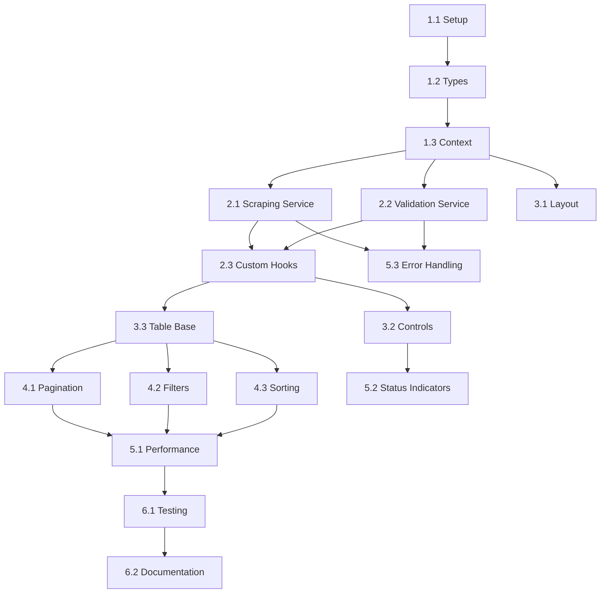

# 📋 Plan de Tareas - Scraper de Proxies Frontend

## 🎯 Resumen del Proyecto

Desarrollo de aplicación React SPA con TypeScript para scraping y validación de proxies desde hide.mn

---

## 📊 Fases de Desarrollo

### 🏗️ **FASE 1: Configuración y Estructura Base** (Días 1-3)

#### **Tarea 1.1: Setup del Proyecto**

**Prioridad:** 🔴 Crítica  
**Estimación:** 4 horas  
**Dependencias:** Ninguna

**Subtareas:**

- [ ] Instalar dependencias base del proyecto
- [ ] Configurar Tailwind CSS
- [ ] Añadir dependencias específicas (cheerio, playwright)
- [ ] Configurar variables de entorno
- [ ] Setup de alias de rutas en Vite

**Comandos a ejecutar:**

```bash
bun add cheerio @playwright/test
bun add -D tailwindcss @tailwindcss/typography
bun add -D @types/cheerio
bunx tailwindcss init -p
```

**Archivos afectados:**

- `package.json`
- `tailwind.config.js`
- `vite.config.ts`
- `.env`

---

#### **Tarea 1.2: Estructura de Tipos TypeScript**

**Prioridad:** 🔴 Crítica  
**Estimación:** 2 horas  
**Dependencias:** 1.1

**Subtareas:**

- [ ] Crear `src/types/proxy.types.ts`
- [ ] Definir interfaces principales (Proxy, AppState, ValidationConfig)
- [ ] Crear tipos para componentes UI
- [ ] Configurar exports de tipos

**Archivos a crear:**

```
src/
└── types/
    ├── proxy.types.ts
    ├── scraping.types.ts
    ├── validation.types.ts
    └── ui.types.ts
```

**Checklist detallado:**

- [ ] Interface `Proxy` con todas las propiedades
- [ ] Interface `AppState` para manejo de estado global
- [ ] Types para eventos y handlers
- [ ] Tipos de configuración de servicios

---

#### **Tarea 1.3: Configuración de Estado Global**

**Prioridad:** 🔴 Crítica  
**Estimación:** 3 horas  
**Dependencias:** 1.2

**Subtareas:**

- [ ] Crear Context API para estado global
- [ ] Implementar useReducer para manejo de estado
- [ ] Definir acciones del reducer
- [ ] Crear provider wrapper

**Archivos a crear:**

```
src/
├── context/
│   ├── AppContext.tsx
│   ├── AppReducer.ts
│   └── AppProvider.tsx
└── hooks/
    └── useAppContext.ts
```

**Estados a manejar:**

- [ ] Lista de proxies scrapeados
- [ ] Lista de proxies validados
- [ ] Estados de loading (scraping, validating)
- [ ] Paginación actual
- [ ] Errores y mensajes
- [ ] Progreso de operaciones

---

### ⚙️ **FASE 2: Servicios Core** (Días 4-7)

#### **Tarea 2.1: Servicio de Scraping**

**Prioridad:** 🔴 Crítica  
**Estimación:** 6 horas  
**Dependencias:** 1.2, 1.3

**Subtareas:**

- [ ] Implementar ScraperService con fetch y cheerio
- [ ] Método para detectar número total de páginas
- [ ] Función de extracción de proxies por página
- [ ] Rate limiting con delays configurables
- [ ] Error handling con retry automático
- [ ] Progress tracking durante scraping

**Archivo a crear:**

```
src/services/scraperService.ts
```

**Funcionalidades críticas:**

- [ ] `detectTotalPages()` - Analizar DOM de paginación
- [ ] `extractProxiesFromPage()` - Parser HTML para extraer datos
- [ ] `scrapeAllPages()` - Navegación secuencial con progress
- [ ] `fetchWithRetry()` - Error recovery con backoff exponencial
- [ ] Validadores de IP y puerto

---

#### **Tarea 2.2: Servicio de Validación**

**Prioridad:** 🔴 Crítica  
**Estimación:** 8 horas  
**Dependencias:** 1.2, 1.3, 2.1

**Subtareas:**

- [ ] Implementar ValidatorService con Playwright
- [ ] Configuración de browser con proxy
- [ ] Validación individual de proxy
- [ ] Sistema de concurrencia con semáforo
- [ ] Métricas de latencia y estado
- [ ] Circuit breaker para error recovery

**Archivo a crear:**

```
src/services/validatorService.ts
```

**Componentes internos:**

- [ ] Clase `Semaphore` para control de concurrencia
- [ ] Función `validateProxy()` individual
- [ ] Método `validateProxies()` batch con progress
- [ ] Clasificación de tipos de error
- [ ] Cálculo de métricas avanzadas

---

#### **Tarea 2.3: Custom Hooks de Servicios**

**Prioridad:** 🟡 Alta  
**Estimación:** 4 horas  
**Dependencias:** 2.1, 2.2

**Subtareas:**

- [ ] Hook `useProxyScraper` para manejo de scraping
- [ ] Hook `useProxyValidator` para validación
- [ ] Hook `usePagination` para tabla
- [ ] Integración con Context API

**Archivos a crear:**

```
src/hooks/
├── useProxyScraper.ts
├── useProxyValidator.ts
├── usePagination.ts
└── useProgressTracking.ts
```

**Funcionalidades por hook:**

- [ ] `useProxyScraper`: start, stop, progress, results
- [ ] `useProxyValidator`: validate, progress, metrics
- [ ] `usePagination`: currentPage, totalPages, navigation
- [ ] Manejo de cleanup y abort controllers

---

### 🎨 **FASE 3: Componentes UI Base** (Días 8-12)

#### **Tarea 3.1: Layout y Container**

**Prioridad:** 🟡 Alta  
**Estimación:** 3 horas  
**Dependencias:** 1.1, 1.3

**Subtareas:**

- [ ] Componente `Header` con título y navegación
- [ ] Componente `Container` responsive
- [ ] Layout principal de la aplicación
- [ ] Estilos Tailwind base

**Archivos a crear:**

```
src/components/Layout/
├── Header.tsx
├── Container.tsx
└── MainLayout.tsx
```

**Características:**

- [ ] Design responsive mobile-first
- [ ] Header con branding del proyecto
- [ ] Container con max-width y padding apropiado
- [ ] Dark mode support (opcional)

---

#### **Tarea 3.2: Componentes de Control**

**Prioridad:** 🔴 Crítica  
**Estimación:** 5 horas  
**Dependencias:** 1.2, 1.3, 2.3

**Subtareas:**

- [ ] `ActionButton` con estados múltiples
- [ ] `StatusIndicator` para progreso
- [ ] `ErrorDisplay` para manejo de errores
- [ ] `ProgressBar` animada

**Archivos a crear:**

```
src/components/Controls/
├── ActionButton.tsx
├── StatusIndicator.tsx
├── ErrorDisplay.tsx
├── ProgressBar.tsx
└── ControlPanel.tsx
```

**Estados del ActionButton:**

- [ ] Idle: "Iniciar Scraping"
- [ ] Loading: "Extrayendo..." + spinner
- [ ] Validating: "Validando..." + progress
- [ ] Complete: "Reiniciar Proceso"
- [ ] Error: "Error - Reintentar"

---

#### **Tarea 3.3: Tabla de Proxies Base**

**Prioridad:** 🔴 Crítica  
**Estimación:** 6 horas  
**Dependencias:** 1.2, 1.3, 2.3

**Subtareas:**

- [ ] Componente `ProxyTable` principal
- [ ] `ProxyRow` individual optimizado
- [ ] Headers de tabla con sorting
- [ ] Estados empty y loading

**Archivos a crear:**

```
src/components/ProxyTable/
├── ProxyTable.tsx
├── ProxyRow.tsx
├── TableHeader.tsx
└── EmptyState.tsx
```

**Columnas de la tabla:**

- [ ] IP Address (sorteable)
- [ ] Puerto (sorteable)
- [ ] Protocolo (filtrable)
- [ ] Latencia (sorteable, con colores)
- [ ] Estado (con iconos semánticos)
- [ ] País (si disponible)

---

### 🔧 **FASE 4: Funcionalidades Avanzadas** (Días 13-16)

#### **Tarea 4.1: Sistema de Paginación**

**Prioridad:** 🟡 Alta  
**Estimación:** 4 horas  
**Dependencias:** 3.3, 2.3

**Subtareas:**

- [ ] Componente `Pagination` reutilizable
- [ ] Navegación por páginas (10 items/página)
- [ ] Información de totales
- [ ] Jump to page functionality

**Archivo a crear:**

```
src/components/ProxyTable/Pagination.tsx
```

**Características:**

- [ ] Botones Previous/Next
- [ ] Números de página visibles (max 5)
- [ ] Jump directo a página específica
- [ ] Info de "Mostrando X de Y proxies"

---

#### **Tarea 4.2: Sistema de Filtros**

**Prioridad:** 🟡 Alta  
**Estimación:** 5 horas  
**Dependencias:** 3.3, 4.1

**Subtareas:**

- [ ] Filtros por protocolo (http/https)
- [ ] Filtro por rango de latencia
- [ ] Filtro por estado (válido/inválido)
- [ ] Clear filters functionality

**Archivo a crear:**

```
src/components/Filters/
├── FilterBar.tsx
├── ProtocolFilter.tsx
├── LatencyFilter.tsx
└── StatusFilter.tsx
```

**Tipos de filtros:**

- [ ] Dropdown para protocolo
- [ ] Slider range para latencia
- [ ] Toggle switches para estado
- [ ] Search box para IP (opcional)

---

#### **Tarea 4.3: Sorting y Ordenamiento**

**Prioridad:** 🟡 Alta  
**Estimación:** 3 horas  
**Dependencias:** 3.3, 4.1

**Subtareas:**

- [ ] Click handlers en headers
- [ ] Estado de sorting (asc/desc/none)
- [ ] Iconos visuales de sorting
- [ ] Persistencia de orden

**Modificaciones:**

- [ ] Actualizar `TableHeader.tsx`
- [ ] Añadir sorting logic al hook `usePagination`
- [ ] Visual feedback con iconos

---

### ⚡ **FASE 5: Optimizaciones y Polish** (Días 17-20)

#### **Tarea 5.1: Optimizaciones de Performance**

**Prioridad:** 🟢 Media  
**Estimación:** 4 horas  
**Dependencias:** 4.1, 4.2, 4.3

**Subtareas:**

- [ ] React.memo en componentes apropiados
- [ ] useCallback para event handlers
- [ ] useMemo para cálculos costosos
- [ ] Virtualización para listas grandes (react-window)

**Archivos a optimizar:**

- [ ] `ProxyRow.tsx` - memo para evitar re-renders
- [ ] `ProxyTable.tsx` - virtualización si >100 items
- [ ] Hooks - useCallback en handlers
- [ ] Context - split en múltiples contexts si necesario

---

#### **Tarea 5.2: Indicadores de Estado Avanzados**

**Prioridad:** 🟢 Media  
**Estimación:** 3 horas  
**Dependencias:** 3.2, 2.3

**Subtareas:**

- [ ] Toast notifications para eventos
- [ ] Loading skeletons para mejor UX
- [ ] Animated counters para métricas
- [ ] Status badges con colores semánticos

**Archivos a crear:**

```
src/components/UI/
├── Toast.tsx
├── Skeleton.tsx
├── Counter.tsx
└── Badge.tsx
```

---

#### **Tarea 5.3: Error Handling y Recovery**

**Prioridad:** 🟡 Alta  
**Estimación:** 4 horas  
**Dependencias:** 2.1, 2.2, 3.2

**Subtareas:**

- [ ] Error boundaries para componentes
- [ ] Retry mechanisms en UI
- [ ] Graceful degradation
- [ ] Error reporting y logging

**Archivos a crear:**

```
src/components/ErrorBoundary/
├── ErrorBoundary.tsx
├── ErrorFallback.tsx
└── RetryButton.tsx
```

---

### 🧪 **FASE 6: Testing y Documentación** (Días 21-22)

#### **Tarea 6.1: Testing Unitario**

**Prioridad:** 🟢 Media  
**Estimación:** 6 horas  
**Dependencias:** Todas las anteriores

**Subtareas:**

- [ ] Setup de Vitest y React Testing Library
- [ ] Tests para hooks customizados
- [ ] Tests para componentes principales
- [ ] Mocks para servicios

**Archivos a crear:**

```
src/__tests__/
├── hooks/
├── components/
├── services/
└── utils/
```

---

#### **Tarea 6.2: Documentación y README**

**Prioridad:** 🟢 Media  
**Estimación:** 2 horas  
**Dependencias:** 6.1

**Subtareas:**

- [ ] Actualizar README con instrucciones
- [ ] Documentar variables de entorno
- [ ] Guía de desarrollo
- [ ] Troubleshooting guide

---

## 📈 Matriz de Dependencias



---

## ✅ Checklist de Progreso General

### 🏗️ **Fase 1: Fundación** (25% del proyecto)

- [ ] ✅ Dependencias instaladas y configuradas
- [ ] ✅ Tipos TypeScript definidos
- [ ] ✅ Context API y estado global funcionando
- [ ] ✅ Variables de entorno configuradas

### ⚙️ **Fase 2: Servicios** (35% del proyecto)

- [ ] ✅ ScraperService extrayendo proxies correctamente
- [ ] ✅ ValidatorService validando con Playwright
- [ ] ✅ Custom hooks integrando servicios
- [ ] ✅ Progress tracking funcionando

### 🎨 **Fase 3: UI Base** (25% del proyecto)

- [ ] ✅ Layout responsive implementado
- [ ] ✅ Controles de acción funcionando
- [ ] ✅ Tabla básica mostrando proxies
- [ ] ✅ Estados de loading y error

### 🔧 **Fase 4: Funcionalidades** (10% del proyecto)

- [ ] ✅ Paginación implementada
- [ ] ✅ Filtros funcionando
- [ ] ✅ Sorting operativo
- [ ] ✅ UX mejorada

### ⚡ **Fase 5: Polish** (3% del proyecto)

- [ ] ✅ Performance optimizada
- [ ] ✅ Indicadores de estado pulidos
- [ ] ✅ Error handling robusto

### 🧪 **Fase 6: Testing** (2% del proyecto)

- [ ] ✅ Tests unitarios pasando
- [ ] ✅ Documentación completa

---

## 🎯 Criterios de Completitud por Tarea

### ✅ **Criterios de "Tarea Completada":**

1. **Código funciona sin errores de TypeScript**
2. **Pasa linting (bun run lint)**
3. **No hay console.errors en runtime**
4. **Componente es responsive en mobile y desktop**
5. **Maneja casos edge apropiadamente**
6. **Sigue convenciones de naming del proyecto**
7. **Incluye JSDoc para funciones públicas**

### 🔄 **Criterios de "Integración Exitosa":**

1. **Se integra correctamente con Context API**
2. **No rompe funcionalidad existente**
3. **Performance no degradada**
4. **Accessibility básica implementada**
5. **Error boundaries funcionando**

---

## 🚀 Quick Start Development

### **Comandos Esenciales:**

```bash
# Setup inicial
bun install
bun run dev

# Durante desarrollo
bun run lint          # Verificar código
bun run build         # Test de build
bun run preview       # Preview de producción

# Testing
bun run test          # Tests unitarios
bun run test:watch    # Watch mode
```

### **Flujo de Desarrollo Recomendado:**

1. **Crear rama feature/** para cada tarea
2. **Seguir convenciones de commit semántico**
3. **Hacer commits pequeños y frecuentes**
4. **Testear en browser durante desarrollo**
5. **Hacer merge solo cuando tarea esté 100% completa**

---

**📝 Nota:** Este documento debe actualizarse conforme se completen las tareas. Marcar con ✅ cada subtarea completada para tracking de progreso.
